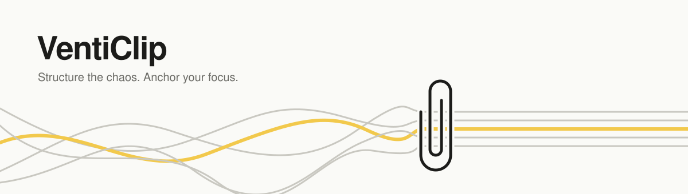

<picture>
  <source media="(prefers-color-scheme: dark)" srcset="./assets/banner-dark.svg">
  
</picture>

 

### Why *VentiClip*?

**venti** — Latin and Italian for *winds*.
**clip** — to fasten, to hold in place.

Thoughts arrive like wind: an article half-read, a line worth remembering, an idea that shows up in the shower and leaves before you find a pen.
We build small tools that **catch what blows past and clip it down** — so it stays where you can come back to it.

Yes, *venti* is also the biggest cup at the coffee shop. The clip holds a lot.

 

### What we're making

> **Grove** is the digital twin of your first brain. **Well** is your second brain.

| | Project | What it does | Status |
|---|---|---|---|
| 🌱 | **Grove** | Your first brain's digital twin — everything you think, plan, and do, kept as readable Markdown in a local-first outliner. | In progress |
| 💧 | **Well** | Your second brain — gathers what's scattered across the outside world into one connected store, so AI can draw exactly what it needs. | In progress |
| 🖍️ | **Margins** | Clip an article or link, highlight what matters, and write in the margins. | In progress |
| 🧭 | **Ikigai** | A conversational agent that helps you understand yourself — and grows what it learns into a structured document, session by session. | In progress |

 

### What we care about

- **Your words stay yours.** Readable formats over lock-in.
- **Calm over clever.** Tools that quiet the noise instead of adding to it.
- **Small and sharp.** Each tool does one thing, and does it well.

 

Structure the chaos. Anchor your focus.

